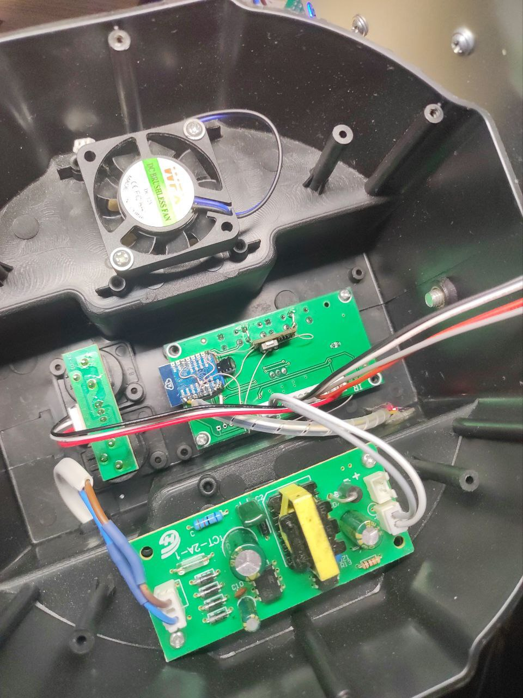

# very simple mqtt to dmx bridge

This is very simple MQTT to DMX bridge based on esp8266 and micropython.
How to install micropython: https://docs.micropython.org/en/latest/esp8266/tutorial/intro.html


### upload

First of all, configure your WIFI network and MQTT server address in boot.py

```
python3.10 webrepl_cli.py -p 1234 umqttsimple.py 192.168.1.42:/umqttsimple.py
python3.10 webrepl_cli.py -p 1234 main.py 192.168.1.42:/main.py
python3.10 webrepl_cli.py -p 1234 boot.py 192.168.1.42:/boot.py
```

### cli

```
python3.10 webrepl_cli.py -p 1234 192.168.1.42
```

### using

there are two methods of updating DMX data json and raw integer by channel:

```
mqtt pub --host=192.168.1.2 --topic=dmx/data -r -m '{1:250,2:50,3:64,4:50}'
```

```
mqtt pub --host=192.168.1.2 --topic=dmx/1 -r -m 250
mqtt pub --host=192.168.1.2 --topic=dmx/2 -r -m 50
mqtt pub --host=192.168.1.2 --topic=dmx/3 -r -m 64
mqtt pub --host=192.168.1.2 --topic=dmx/4 -r -m 50
```

in any case, controller will set high GPIO4 after receiving first value from mqtt, it can drive DE
pin of RS-485 transceiver, DMX data out through UART1 on GPIO2


### photos




